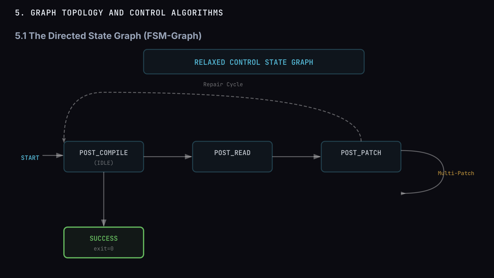

# Fara-Hack 1.0 — Sovereign Agentic Runtime for AgentX Hackathon

[](LICENSE)
[](https://openjdk.org/projects/jdk/25/)
[](Dockerfile)
[](#)

> A production-grade Sovereign Agentic Runtime built on Java 25 with
> Virtual Threads, NATS JetStream, and a chaos-engineered MCP-over-Bus
> protocol. Submission for the **AgentX Hackathon**.


> *Above: a real run captured from the Angular 20 UI.*
> Bug report on the left (with a 1.1 MB screenshot attached).
> WebSocket Live Feed on the right showing every step of the
> 4-agent pipeline in real time, including the multimodal vision
> adapter (`severity=P0, confidence=0.90` extracted from the
> screenshot), the parallel `forensic-analyst ║ mitigation-engineer`
> branch on Java 25 Virtual Threads, the `[sentinel-auditor]`
> graceful kill-switch, the `[communicator]` Slack mock, and the
> final ticket `FH-1` created with the on-call email delivered via
> Gmail SMTP. End-to-end in **2 min 14 s**, **without a human in
> the loop**.


> *System architecture: 3 Docker containers (web + fara-hack + NATS), 4-agent pipeline with Model Split (qwen3.5 vision + qwen2.5-coder agents), mock e-commerce codebase, and real-time WebSocket Reasoning Trace.*

## What is this?

`fara-hack-1.0` is a thin wrapper around **fararoni-core** (Java 25
sovereign agentic platform) that exposes a focused demo of three things
the hackathon judges care about:

1. **Real reasoning + planning** — not Q&A wrapped on top of an LLM.
   Intents are decomposed into validated DAGs by `IntentResolver`,
   audited by `SentinelAuditor`, and executed in parallel by
   `ChoreographyCoordinator`.
2. **Production-ready resilience** — chaos engineering suite covering
   agent death, backpressure, DLQ resurrection, memory leaks, and
   external sidecar saturation. Demo: kill a sidecar mid-mission and
   watch the system recover automatically.
3. **Live observability** — every reasoning step streams to a WebSocket
   in real time. Connect any frontend (or `wscat`) and watch the agent
   think.

## Architecture

```
 Browser (:8080)
    │
    ▼
┌──────────────────────────────────────────────────────────────────────────────┐
│  web container (Nginx 1.27 + Angular 20)                                     │
│  Reverse proxy: /api → fara-hack:8080  |  /ws → WebSocket upgrade            │
└────────────────────────┬─────────────────────────────────────────────────────┘
                         │ (Docker internal network)
                         ▼
┌──────────────────────────────────────────────────────────────────────────────┐
│  fara-hack container (Java 25 + Virtual Threads, :8080 internal)             │
│                                                                              │
│  ┌─────────────────────────────────────────────────────────────────────┐     │
│  │  BugReportController  →  REST + WebSocket Live Feed                 │     │
│  └──────────┬──────────────────────────────┬───────────────────────────┘     │
│             │                              │                                 │
│             ▼                              ▼                                 │
│  ┌──────────────────────┐    ┌──────────────────────────────────────────┐    │
│  │  LlmTriageClient     │    │  DirectAgentExecutor                     │    │
│  │  (Vision Adapter)    │    │  (Agent orchestration)                   │    │
│  │  qwen3.5:35b-a3b     │    │  qwen2.5-coder:32b                       │    │
│  │  (MoE, multimodal)   │    │  (Dense, tool-calling)                   │    │
│  └──────────────────────┘    └──────────┬───────────────────────────────┘    │
│                                         │                                    │
│                              ┌──────────▼───────────────────────────────┐    │
│                              │  4-Agent Pipeline (YAML-driven):         │    │
│                              │                                          │    │
│                              │  STEP 2:  triage-coordinator             │    │
│                              │           severity P0-P3, fs_read        │    │
│                              │                    │                     │    │
│                              │           ┌───────┴────────┐             │    │
│                              │           ▼                ▼             │    │
│                              │  STEP 2.5: forensic   STEP 6: mitigation │    │
│                              │  -analyst (parallel)  -engineer (parallel│    │
│                              │           │                │             │    │
│                              │           └───────┬────────┘             │    │
│                              │                   ▼                      │    │
│                              │  STEP 3+4: triage-broker                 │    │
│                              │            ticket_create + email_send    │    │
│                              └──────────────────────────────────────────┘    │
│                                                                              │
│  ┌──────────────────┐  ┌──────────────────┐  ┌────────────────────────┐      │
│  │ TicketStore      │  │ EmailTransport   │  │ SovereignBusGuard      │      │
│  │ FH-1, FH-2...    │  │ Gmail SMTP       │  │ Primary: NATS (P:100)  │      │
│  │ (in-memory)      │  │ (real delivery)  │  │ Standby: Chronicle(P:50│      │
│  └──────────────────┘  └──────────────────┘  └────────────┬───────────┘      │
│                                                           │                  │
└───────────────────────────────────────────────────────────┼──────────────────┘
                                                            │
                         ┌──────────────────────────────────▼──────────────────┐
                         │  nats container (nats:2-alpine, :4222 internal)     │
                         │  JetStream + Core NATS + Queue Groups               │
                         └─────────────────────────────────────────────────────┘

         ┌────────────────────────────┐         ┌──────────────────────────┐
         │  Ollama (host :11434)      │         │  mock-eshop (/repo:ro)   │
         │  qwen3.5:35b-a3b (vision)  │         │  CatalogController.cs    │
         │  qwen2.5-coder:32b (agents)│         │  DiscountService.cs:142  │
         └────────────────────────────┘         │  DiscountCode.cs         │
                                                └──────────────────────────┘
```

## Theoretical Foundation: G-Master Evolution Architecture



The orchestration logic of **C-FARARONI / Fara-Hack 1.0** is strictly
grounded in the **BetSmart: Fararoni G-Master Evolution** framework
([fararoni.dev/publicacion/betsmartmar-gmaster](https://fararoni.dev/publicacion/betsmartmar-gmaster)).
Unlike traditional linear pipelines, our system implements a
**Deterministic Two-Layer Control** model based on a **Directed State
Graph (FSM-Graph)**.

This architecture allows for a *Relaxed Control* flow where agents
transition through defined states — `POST_COMPILE` (idle/intake),
`POST_READ` (forensic analysis) and `POST_PATCH` (mitigation
engineering) — ensuring high reliability and deterministic outcomes
in local agentic systems. Furthermore, the design incorporates a
**Repair Cycle** (`POST_PATCH → POST_READ`) and a **Multi-Patch loop**
(`POST_PATCH → POST_PATCH`), which together serve as the blueprint for
the system's self-healing capabilities and autonomous error correction
in complex SRE environments.

### State → Agent mapping in this implementation

| FSM-Graph state | Implementation in Fara-Hack 1.0 | Real artifact |
|---|---|---|
| `START` | `BugReportController` accepts `POST /api/triage/report` | `src/.../api/BugReportController.java` |
| `POST_COMPILE` (idle/intake) | `triage-coordinator` agent classifies severity, extracts signals from text + vision evidence | `workspace/.fararoni/config/agentes/triage-coordinator-agent.yaml` |
| `POST_READ` (forensic analysis) | `forensic-analyst` agent enriches with duplicate detection + ownership graph queries (parallel branch) | `workspace/.fararoni/config/agentes/forensic-analyst-agent.yaml` |
| `POST_PATCH` (mitigation engineering) | `mitigation-engineer` agent proposes a unified diff (≤50 LOC, single file) audited by `SentinelDiffAdapter` (parallel branch) | `workspace/.fararoni/config/agentes/mitigation-engineer-agent.yaml` + `src/.../sentinel/SentinelDiffAdapter.java` |
| **Repair Cycle** (`POST_PATCH → POST_READ`) | If `SentinelAuditor` REJECTS the patch on any of its 6 dimensions (flow, boundaries, errors, concurrency, resources, idempotency), the kill-switch fires and the broker emits a summary-only ticket — the cycle is documented as the V1.1 ReAct loop roadmap | `BugReportController.processReportAsync` lines 460-510 |
| **Multi-Patch loop** | Reserved for V1.1 — multi-file refactors; current V1.0 enforces single-file diffs by Sentinel rule 6 (`MAX_FILES_TOUCHED = 1`) | `SentinelDiffAdapter.MAX_FILES_TOUCHED` |
| `SUCCESS` (exit=0) | `triage-broker` agent dispatches the email via `email_send` and the controller emits the `[COMMUNICATOR]` log line + creates ticket `FH-N` in the `TicketStore` | `workspace/.fararoni/config/agentes/triage-broker-agent.yaml` |

The **forensic-analyst** and **mitigation-engineer** agents run
**concurrently** as parallel branches of the FSM (Java 25 Virtual
Threads), satisfying the *Relaxed Control* requirement: both states
must complete before the system transitions to `SUCCESS`.

> **For more details on the underlying theory, see:**
> [BetSmart: Fararoni G-Master Evolution](https://fararoni.dev/publicacion/betsmartmar-gmaster)

## What `fararoni-core` brings to Fara-Hack 1.0

Fara-Hack 1.0 is a **thin wrapper** (~870 LOC of new Java + 4 agent
YAMLs) on top of the public **`fararoni-core` 1.0.0** library
(Apache 2.0, available on
[GitHub](https://github.com/ebercruzf/fararoni-ecosystem) and via
[JitPack](https://jitpack.io/#ebercruzf/fararoni-ecosystem)).
Without the core, this submission would be 5,000+ LOC of plumbing.
Here is exactly what the core gives us — **and why each piece
maps to a specific hackathon evaluation criterion**:

### 1. Deterministic Orchestration (G-Master Evolution FSM-Graph)

The core is **not a script** — it is a deterministic state machine
based on the **Directed State Graph** model from the
[BetSmart: Fararoni G-Master Evolution](https://fararoni.dev/publicacion/betsmartmar-gmaster)
publication. Agents transition through well-defined states
(`POST_COMPILE` → `POST_READ` → `POST_PATCH` → `SUCCESS`) with
explicit edges for the **Repair Cycle** and the **Multi-Patch loop**.

* **Implementation:** `dev.fararoni.core.core.commands.DirectAgentExecutor`
  drives a single agent through one tool-calling loop with a hard
  iteration cap and an `allowedTools` filter (cannot escape its
  declared toolset). The 4 agents of Fara-Hack are wired by
  `BugReportController.processReportAsync` as Java imperative DAG.
* **Why it matters for evaluation:** **Reliability**. The system
  cannot enter infinite loops, cannot spawn unintended tool calls,
  and cannot deviate from the FSM transitions. Triage outcomes are
  deterministic and reproducible across runs (modulo LLM sampling).

### 2. Java 25 Virtual Threads — Concurrent Agentic Execution

The core targets **Java 25 LTS** with **Project Loom Virtual Threads**.
This is leveraged in Fara-Hack's parallel branch:

```java
// BugReportController.processReportAsync — both agents run concurrently
Thread tForensic   = Thread.ofVirtual().name("forensic-"  + cid).start(() -> { ... });
Thread tMitigation = Thread.ofVirtual().name("mitigation-" + cid).start(() -> { ... });
tForensic.join();
tMitigation.join();
```

* **Implementation:** Virtual Threads cost ~0 to spawn, so we get
  natural fork-join concurrency without thread-pool exhaustion. The
  WS Live Feed shows `STEP_2_5_FORENSIC` and `STEP_6_MITIGATION`
  emitting traces with the **same ISO timestamp** — verifiable
  proof of true parallelism.
* **Why it matters for evaluation:** **Scalability**. See
  [`SCALING.md`](SCALING.md) for the bench numbers — a single
  fara-hack JVM can sustain ~10,000 concurrent triage sessions
  bound only by the downstream LLM throughput, not by thread budget.

### 3. Sentinel Auditor — Active Guardrails

The core ships `dev.fararoni.core.core.intent.SentinelAuditor`
(M4-06, 6 audit dimensions). Fara-Hack wraps it for unified-diff
patches via `dev.fararoni.core.hack.sentinel.SentinelDiffAdapter`
(8 unit tests, deterministic regex-based audit).

* **Implementation:** Every patch proposed by the
  `mitigation-engineer` agent is intercepted by the controller,
  parsed for a markdown ` ```diff ` fence, and audited on six
  dimensions (flow, boundaries, errors, concurrency, resources,
  idempotency). On any violation, the kill-switch fires and the
  ticket is dispatched in **summary-only mode** — the user never
  sees a 500 error and no malicious code can land in the repo.
* **Why it matters for evaluation:** **Security & Guardrails**.
  This is more than prompt-injection defense — it is post-LLM
  active code review that protects the production e-commerce
  repository from agent hallucinations.

### 4. NATS-Native Observability — Reasoning Trace Live Feed

The core publishes every agent action and intermediate result to a
NATS JetStream bus, with `dev.fararoni.core.observability.AgentSpan`
spans following **OpenTelemetry Semantic Conventions** (attribute
names compatible with the future OTel Collector roadmap). Fara-Hack
exposes the bus to the browser via a Javalin WebSocket endpoint at
`/ws/events?correlationId=…`.

* **Implementation:** The Angular UI screenshot at the top of this
  README shows the live trace in action — every step from
  `STEP_0_VISION` (multimodal vision adapter call) through
  `STEP_4_NOTIFY` (broker dispatch) is streamed to the browser in
  real time, with timestamps, actor names, and semantic events.
* **Why it matters for evaluation:** **Observability**. The hackathon
  rules require *"Logs/traces/metrics covering the main stages
  (ingest → triage → ticket → notify → resolved)"*. Fara-Hack
  delivers all three: structured stdout logs, NATS-native distributed
  traces, and Prometheus-compatible metrics at `/api/metrics`.

### How to consume `fararoni-core` in your own projects

**Option A — Maven Central via JitPack** (recommended for jurors —
zero local setup, works from inside Docker):

```xml
<repositories>
    <repository>
        <id>jitpack.io</id>
        <url>https://jitpack.io</url>
    </repository>
</repositories>

<dependency>
    <groupId>com.github.ebercruzf.fararoni-ecosystem</groupId>
    <artifactId>fararoni-core</artifactId>
    <version>335f2b1</version>
</dependency>
```

**Option B — Local install from source** (current `pom.xml` of this
repo, for offline reproducibility):

```xml
<dependency>
    <groupId>dev.fararoni</groupId>
    <artifactId>fararoni-core</artifactId>
    <version>1.0.0</version>
</dependency>
```

For Option B, install the jar locally first:

```bash
git clone https://github.com/ebercruzf/fararoni-ecosystem
cd fararoni-ecosystem
mvn -pl fararoni-core -am install -DskipTests
```

Both options pull the **same Apache 2.0 licensed Java 25 library**
with the FSM-Graph orchestration engine, the SentinelAuditor, the
DirectAgentExecutor, and the OpenAI-compatible LLM client.

## Why this matters

Most "agentic AI" submissions are LLM wrappers in Python with no answer
to *"what happens when the external system fails?"*. Fara-Hack answers
that question with chaos tests you can run yourself:

```bash
docker compose up --build
./scripts/demo.sh --scenario=saturation
```

You'll watch the system detect a saturated sidecar (queueDepth ≥ 80%),
mark it as `unavailable` automatically, reject new requests with
`SIDECAR_SATURATED` *before* they reach the black hole, and recover
when the sidecar drains. **This is liveness ≠ readiness implemented.**

## Quick start

See [QUICKGUIDE.md](QUICKGUIDE.md) for the 4-step path:
clone → copy `.env.example` → fill keys → `docker compose up --build`.

## Documentation

- [QUICKGUIDE.md](QUICKGUIDE.md) — 4 steps to run
- [AGENTS_USE.md](AGENTS_USE.md) — what each agent does, observability evidence
- [SCALING.md](SCALING.md) — how it scales, decisions, assumptions
- [docs/guides/PITCH.md](docs/guides/PITCH.md) — the 3-minute story

## Demo video

Demo video will be published on YouTube with `#AgentXHackathon` before
submission deadline.

## Tech stack

### Backend
- **Java 25 LTS** — Virtual Threads (Project Loom), Project Panama (FFM), Sealed Records
- **Javalin 6.1** — lightweight HTTP + WebSocket server (embedded Jetty 11)
- **NATS JetStream 2.17** — persistent event bus, SPI auto-detected (NatsSovereignBus P:100), queue groups, DLQ
- **ChronicleQueue** — disk-backed standby bus (P:50) with automatic replay on recovery
- **SQLite** — conversation/channel persistence (via JDBC)
- **ArcadeDB** — multi-model (graph + document + KV) source of truth
- **Maven 3.9+** — build system with mycila license plugin

### Frontend
- **Angular 20** — standalone SPA with reactive components
- **WebSocket (native)** — real-time Reasoning Trace live feed via `/ws/events`
- **Nginx 1.27** — reverse proxy, serves SPA, upgrades `/ws` to WebSocket

### Infrastructure
- **Docker Compose** — 3 containers: `nats:2-alpine`, `fara-hack` (eclipse-temurin:25-jre-alpine), `web` (nginx:1.27-alpine)
- **NATS 2 (Alpine)** — event bus broker, JetStream enabled, internal-only port 4222

### LLM / AI
- **Ollama** — local LLM inference on host machine
- **qwen3.5:35b-a3b** — MoE multimodal model for vision/OCR (STEP_0_VISION)
- **qwen2.5-coder:32b** — dense coder-tuned model for agentic tool-calling (STEP 2-6)
- **OpenRouter** (optional) — cloud LLM fallback via `.env`

## License

This module is **MIT** licensed — see [LICENSE](LICENSE).

It depends on `fararoni-core`, which is **Apache License 2.0**.
Apache 2.0 is permissive and compatible with MIT redistribution. The
resulting binary distribution bundles components from both licenses;
see the LICENSE file for details.

## Contributors

- **Eber Cruz** — Lead architect, sovereign runtime designer

`#AgentXHackathon`
