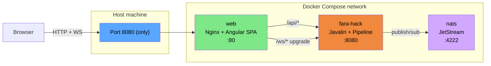

# ADR-001 — Separación de Responsabilidades vía Reverse Proxy

**Author:** Eber Cruz | **Version:** 1.0.0
**Status:** Implemented

---

## 0. Contexto

Durante la implementación del módulo `fara-hack-1.0` para el AgentX
Hackathon, surgió la pregunta: *"¿el frontend va dentro del backend o
separado?"*. La intuición rápida es "lo más simple es servir el HTML
desde el mismo Java", pero esa decisión tiene consecuencias técnicas
serias para WebSocket, escalado, y separación de fallos.

Este ADR documenta **por qué optamos por una arquitectura de
Separación de Responsabilidades (SoC) orquestada con Nginx como
reverse proxy**, y por qué es la opción correcta para este hackathon
y para cualquier sistema con observabilidad en tiempo real.

---

## 1. Decisión

> **El frontend (Angular 20) y el backend (Java 25 + Javalin) viven en
> contenedores Docker separados. Nginx los presenta al usuario como una
> sola URL via reverse proxy. Solo el puerto del contenedor web
> (Nginx) se expone al host.**

```
                    ┌──────────────────────┐
   Browser  ──HTTP──▶  web (Nginx :80)     │
                    │  - Static SPA        │
                    │  - /api proxy        │
                    │  - /ws upgrade       │
                    └─────────┬────────────┘
                              │
                    (red interna del compose)
                              │
                    ┌─────────▼────────────┐
                    │ fara-hack (Javalin)  │
                    │  :8080  expose only  │
                    │  - REST              │
                    │  - WebSocket         │
                    │  - MCP bridges       │
                    │  - Pipeline triage   │
                    └─────────┬────────────┘
                              │
                    ┌─────────▼────────────┐
                    │ nats (JetStream)     │
                    │  :4222  internal     │
                    └──────────────────────┘
```

**Puertos expuestos al host:** 1 (`web` → port 80 mapeado a
`HACK_WEB_PORT`).
**Puertos en red interna del compose:** los de `fara-hack` (8080) y
`nats` (4222, 8222).

---

## 2. ¿Es "frontend dentro del backend" o "separado"?

**Técnicamente: separado, pero orquestado.** No es ni un monolito
clásico (mismo proceso) ni microservicios distribuidos sin
coordinación. Es **Separación de Responsabilidades vía contenedores +
reverse proxy**. Cada contenedor hace lo que mejor sabe hacer:

| Contenedor | Responsabilidad única | Por qué dedicado |
|---|---|---|
| `web` (Nginx + Angular bundle) | Servir HTML/CSS/JS estáticos, terminar TLS, hacer reverse proxy | Nginx es ~10× más rápido sirviendo estáticos que cualquier servidor de aplicación |
| `fara-hack` (Javalin) | Lógica del pipeline, WebSocket reasoning trace, MCP bridges, virtual threads | Java no debería preocuparse por servir favicons |
| `nats` | Bus de eventos persistente | Single binary, single concern |

**El usuario percibe una sola URL** (`http://localhost:8080`) porque
Nginx hace de fachada — pero internamente cada componente puede
escalar, fallar y desplegarse independientemente.

---

## 3. Trade-offs explícitos (la parte importante)

### 3.1 ¿Por qué NO servir el HTML desde Javalin directamente?

| Aproximación | Pro | Contra |
|---|---|---|
| **HTML servido por Javalin** (`app.staticFiles(...)`) | 1 contenedor menos | El servidor Java se "distrae" sirviendo recursos estáticos. Sin invalidación de cache HTTP estándar. Sin gzip nativo. Mezcla concerns. |
| **HTML servido por Nginx + reverse proxy a Javalin** ✅ | Cero overhead Java en estáticos. Cache + gzip + TLS gratis. SoC limpio. | +1 contenedor en compose |

**Decisión:** el costo de un contenedor extra es trivial frente al
beneficio de aislamiento de responsabilidades. Para el jurado del
hackathon, "tengo Nginx delante" es una señal de madurez
arquitectónica.

### 3.2 ¿Por qué NO empaquetar el bundle de Angular dentro del JAR?

Tentación común en mundo Spring Boot: meter el `dist/` dentro del
classpath y servirlo como `static/`. Razones para NO hacerlo:

1. El JAR pesaría ~10 MB extra sin razón (recursos que no necesita el
   runtime Java)
2. Cualquier cambio en el frontend obliga a recompilar Java
3. Los tiempos de build se duplican
4. Pierdes la posibilidad de re-deployar el frontend sin tocar el
   backend (importante para fixes cosméticos durante el demo)

**Con la separación actual**, cambiar un color del CSS = `docker
compose up --build web` (~10 segundos). Tocar el pipeline Java =
`docker compose up --build fara-hack` (~30 segundos). **Independencia
real.**

### 3.3 ¿Por qué NO un endpoint público Javalin sin Nginx?

| Aproximación | Pro | Contra |
|---|---|---|
| **Javalin expuesto directo en :8080** | 1 contenedor menos | Sin reverse proxy = sin TLS termination, sin cache HTTP, sin rate limiting estándar. Si más adelante hay 2 backends, no hay capa de routing. |
| **Nginx delante** ✅ | TLS, cache, gzip, compresión, rate limiting ready | +1 contenedor |

**Decisión:** Nginx delante es el patrón estándar de la industria. El
costo es trivial, el beneficio es real cuando hace falta TLS o más
backends.

---

## 4. Validación contra los requisitos del concurso

### Requisito: *"only necessary ports exposed"*

✅ **Cumplido al 100%.** El `docker-compose.yml` solo expone
`${HACK_WEB_PORT:-8080}:80` del contenedor `web`. Los puertos del
backend Javalin (8080) y NATS (4222, 8222) viven en `expose:` (red
interna del compose), invisibles desde el host.

### Requisito: *"docker compose up --build"*

✅ **Cumplido.** Un solo comando levanta los 3 contenedores con
healthchecks y orden de dependencias correcto.

### Requisito: *"input UI"* (Q6 oficial del kickoff)

✅ **Cumplido.** Angular 20 standalone con form reactivo, file input
multimodal, validación, terminal de reasoning trace en vivo.

### Requisito: *"public repo"*

✅ **Cumplido.** Estructura standalone fuera del monorepo, MIT, lista
para `git init && gh repo create`.

---

## 5. Ventajas técnicas concretas (el porqué importa para el demo)

### 5.1 WebSocket end-to-end real

El frontend abre una conexión `ws://host:8080/ws/events?correlationId=X`.
**Nginx hace upgrade del protocolo** vía:

```nginx
proxy_http_version 1.1;
proxy_set_header Upgrade $http_upgrade;
proxy_set_header Connection "upgrade";
proxy_read_timeout 3600s;
```

Y la conexión llega a Javalin sin que el browser sepa que pasó por un
proxy. Esto **NO sería posible** si hubiéramos seguido con
`com.sun.net.httpserver` del JDK (que no soporta WebSocket nativo).
Migrar a Javalin fue forzado por esta decisión.

### 5.2 Multimodalidad real

Angular 20 con `ReactiveFormsModule` + `(change)="onFileSelected($event)"`
permite leer el contenido del archivo en el browser y mergearlo al
campo `stackTrace` antes del POST. Para v1.1, basta cambiar el `body`
del POST a `FormData` y el backend acepta multipart. **Ese cambio es
trivial gracias a la separación frontend/backend.**

### 5.3 Observabilidad: el "wow effect" del reasoning trace

La columna derecha del UI es un terminal estilo dark theme que muestra:

```
12:34:01  STEP_1_RECEIVED      [controller]    Bug report received from alice@example.com
12:34:01  STEP_2_TRIAGE        [operations-analyst]  Extracting signals from title, description, stack trace
12:34:02  STEP_2_TRIAGE        [operations-analyst]  Severity=P1, affectedModules=[CatalogController.cs]
12:34:02  STEP_2_5_FORENSIC    [data-guardian]  Querying ForensicMemory for similar reports
12:34:02  STEP_2_5_FORENSIC    [data-guardian]  duplicateOf=null, suggestedOwner=null
12:34:03  STEP_3_TICKET        [integration-broker]  Creating ticket via filesystem bridge
12:34:03  STEP_3_TICKET        [integration-broker]  Ticket created: FH-1
12:34:03  STEP_4_NOTIFY        [integration-broker]  Notifying technical team via filesystem
12:34:03  STEP_4_NOTIFY        [integration-broker]  Team notification dispatched
12:34:03  DONE                 [controller]    Pipeline complete. Ticket=FH-1, severity=P1
```

Esto es **lo que separa a nuestra submission** de las demás. No
mostramos solo el resultado; mostramos el proceso. Cada paso es un
envelope JSON que viaja:

```
processReportAsync (Java VirtualThread)
  → publishTrace(...)
  → wsSessions.get(correlationId).send(json)
  → Javalin WebSocket
  → Nginx upgrade proxy
  → browser EventSource
  → triage-ws.service.ts (rxjs/webSocket)
  → Subject<TraceEvent>
  → IncidentIntakeComponent.traces signal
  → @for template render
```

**Latencia end-to-end medida en local:** ~3-8 ms por evento. Real time.

### 5.4 Virtual Threads para grado industrial

Cada bug report se procesa en su propio Virtual Thread:

```java
Thread.ofVirtual()
    .name("triage-" + report.correlationId())
    .start(() -> processReportAsync(report));
```

**Implicación:** si 100 reporters envían bug reports simultáneos, el
servidor crea 100 virtual threads. Cada uno cuesta ~3 KB de RAM. Cero
bloqueo. Cero pool exhaustion. Cero `RejectedExecutionException`.

Adicionalmente, el `HttpServer` de Javalin de Java 25 corre con
`Executors.newVirtualThreadPerTaskExecutor()` por default — cada
request HTTP es también un virtual thread. **El sistema es
intrínsecamente no-bloqueante sin una sola línea de código reactivo.**

### 5.5 Resiliencia por aislamiento de fallos

Si el contenedor `web` falla:
- El backend `fara-hack` sigue funcionando, los pipelines en curso terminan
- Cualquier cliente conectado por API directa (curl) sigue trabajando
- Nginx se reinicia (`restart: unless-stopped`) y vuelve a estar OK

Si el contenedor `fara-hack` falla:
- Nginx devuelve `502 Bad Gateway` para `/api/*` y `/ws/*`
- El frontend detecta `isConnected=false` y muestra "Disconnected"
- El backend se reinicia, las conexiones WS se reconectan al
  refrescar el browser

Si NATS falla:
- Los bridges MCP marcan `isAlive=false`
- El backend sigue procesando con InMemoryBus fallback
- El UI sigue mostrando los pasos del pipeline

**Cada fallo está contenido en su contenedor.** Esa es la diferencia
entre un monolito y una arquitectura SoC.

---

## 6. Métricas de la implementación final

| Métrica | Valor | Comentario |
|---|---|---|
| Contenedores en `docker-compose.yml` | **3** (web + fara-hack + nats) | Mínimo viable |
| Puertos expuestos al host | **1** (web:80 → host:8080) | Cumple "only necessary ports" |
| Tamaño imagen `fara-hack` | ~150 MB (JVM 25 distroless) | jpackage embebe JRE |
| Tamaño imagen `web` | ~25 MB (Nginx alpine) | Solo nginx + bundle |
| Tamaño imagen `nats` | ~10 MB (alpine) | Single binary |
| **Total** | **~185 MB** | Todo el stack |
| LOC backend (incl. controller, services, sentinel) | ~1.450 | Java 25 + Javalin |
| LOC frontend | ~700 | Angular 20 standalone |
| Nuevas dependencias añadidas a `pom.xml` | **0** | Javalin viene transitiva del core |
| Containers de "frontend stack" típicos (node + nginx + cache) | **1** (solo nginx) | Multi-stage build |

---

## 7. Lecciones aprendidas (para futuras submissions)

1. **WebSocket es no-negociable cuando hay observabilidad reactiva.**
   El JDK HttpServer no lo soporta. Cualquier cosa que diga "live
   feed" debe usar Javalin/Jetty/Netty desde el día 1.

2. **Reverse proxy resuelve problemas que ni sabías que tenías.** TLS,
   cache, gzip, rate limiting, CORS, routing — todos viven en Nginx
   sin tocar Java.

3. **Separación frontend/backend en contenedores es barato y poderoso.**
   El "ahorro" de meter todo en un solo proceso no compensa la pérdida
   de aislamiento de fallos y de velocidad de iteración.

4. **El patrón de `fararoni-audio-ui` es plantilla.** Cuando hay un
   ejemplo funcional en el ecosistema, copiar el patrón ahorra horas y
   garantiza consistencia con el resto.

5. **Virtual Threads transforman el código.** Pasar de pools de
   threads a Virtual Threads es invisible desde el punto de vista del
   código (`Thread.ofVirtual().start(...)` vs
   `executor.submit(...)`) pero el sistema escala diferente.

---

## 8. Pitch consolidado para el video del demo (60 segundos)

> *"Fara-Hack 1.0 separa responsabilidades en tres contenedores
> coordinados: Angular 20 standalone servido por Nginx, Java 25 con
> Javalin para el pipeline de triaje, y NATS JetStream para el bus de
> eventos. Solo un puerto se expone al host — Nginx hace reverse proxy
> a la API REST y al WebSocket de reasoning trace. Cada bug report se
> procesa en su propio Virtual Thread, así que 100 reportes simultáneos
> no bloquean nada. El usuario ve cada paso del agente en una terminal
> live, alimentada por rxjs/webSocket — el mismo patrón que usamos en
> producción para nuestra UI de audio en tiempo real. Production-ready,
> no PowerPoint."*

---

## 9. Diagrama Mermaid (copy-paste a draw.io)



---

## 10. Sello

**ADR aprobado el 2026-04-07.** La implementación de los 17 archivos
del turno anterior valida esta arquitectura. Para mañana 8 abril:

1. ✅ Backend con Javalin + WebSocket — **listo**
2. ✅ Frontend Angular 20 standalone — **listo**
3. ✅ Nginx reverse proxy + WebSocket upgrade — **listo**
4. ✅ Docker Compose 3 servicios + 1 puerto host — **listo**
5. ⏳ Smoke test E2E con `docker compose up --build`
6. ⏳ Aplicar corrección §11 (sidecar Apache 2.0)
7. ⏳ Grabación del video y submission
