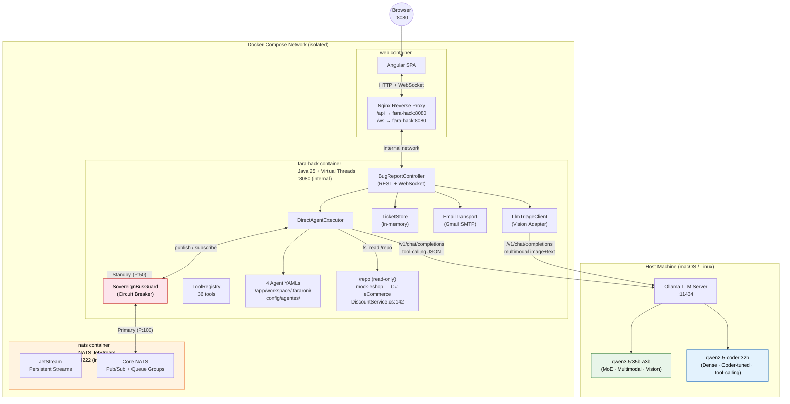
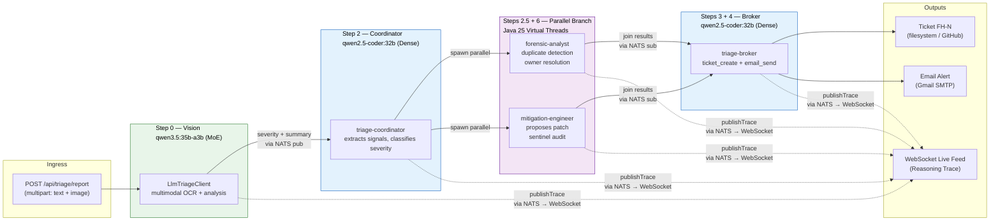
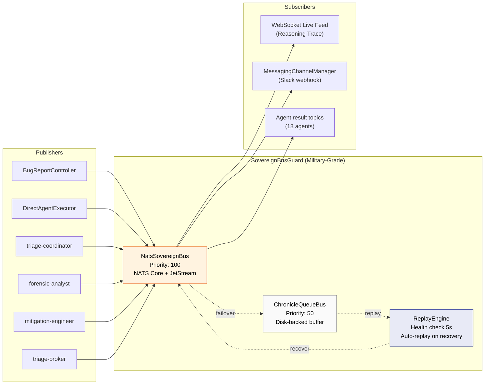
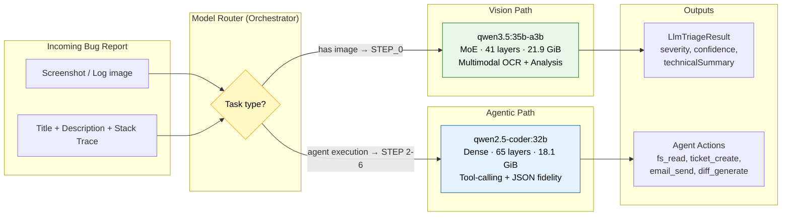

# Architecture Diagram — Fara-Hack 1.0

**Author:** Eber Cruz | **Version:** 1.0.0

> High-level architecture showing the full system: Docker containers,
> NATS event bus, Model Split Strategy, and the 4-agent pipeline.
> Renderizable in GitHub, Mermaid Live Editor, or any Mermaid-compatible viewer.

---

## 1. System Architecture (Container View)



---

## 2. Agent Pipeline Flow (with NATS Bus)



---

## 3. NATS Event Bus Detail



---

## 4. Model Split Strategy



---

## 5. Agent Configuration (4 YAML Prompts)

All agents live in `workspace/.fararoni/config/agentes/` and are loaded at boot by `AgentTemplateManager`.

| Agent | YAML | LLM | System Prompt (summary) | Allowed Tools |
|---|---|---|---|---|
| **triage-coordinator** | `triage-coordinator-agent.yaml` | qwen2.5-coder:32b | Classifies severity (P0-P3), extracts file paths from stack trace, emits strict JSON. "La severidad NO se negocia." | `fs_read`, `code_search` |
| **forensic-analyst** | `forensic-analyst-agent.yaml` | qwen2.5-coder:32b | Detects duplicate incidents, resolves code ownership, queries forensic memory for similar past reports. | `arcadedb_query`, `forensic_memory_search` |
| **mitigation-engineer** | `mitigation-engineer-agent.yaml` | qwen2.5-coder:32b | Proposes a unified diff patch (max 50 LOC, single file), audited by SentinelDiffAdapter before attaching to ticket. | `fs_read`, `sentinel_audit`, `diff_generate` |
| **triage-broker** | `triage-broker-agent.yaml` | qwen2.5-coder:32b | Dispatches ticket creation and email notification to on-call engineer. Final step of the pipeline. | `ticket_create`, `email_send`, `arcadedb_write`, `mcp_dispatch` |

### Mock e-Commerce Codebase

The agents have read-only access to a mock e-commerce codebase mounted at `/repo` inside the container (bind mount `./mock-eshop:/repo:ro`):

```
mock-eshop/src/Services/Catalog.API/
├── Controllers/CatalogController.cs
├── Models/DiscountCode.cs
└── Services/DiscountService.cs          ← bug at line 142 (NullReferenceException)
```

This simulates a medium-complexity C# e-commerce application (Microsoft eShop pattern). The `triage-coordinator` agent uses `fs_read` to inspect the source code referenced in stack traces.

### Frontend — fara-hack-web (Angular 20)

| Component | Technology | Purpose |
|---|---|---|
| **SPA Framework** | Angular 20.3 (standalone components) | Bug report form + Reasoning Trace panel |
| **WebSocket Client** | Native browser WebSocket API | Real-time live feed from `/ws/events?correlationId=X` |
| **HTTP Client** | Angular HttpClient | REST calls to `/api/triage/report`, `/api/triage/tickets` |
| **Reverse Proxy** | Nginx 1.27 Alpine | Serves SPA, proxies `/api` and upgrades `/ws` to WebSocket |
| **Build** | `ng build --configuration production` inside Docker (Node 22 Alpine) | Zero host dependencies |

### Ticket System — TicketStore

In-memory `ConcurrentHashMap<String, Ticket>` with atomic sequence counter (`FH-1`, `FH-2`, ...). Exposed via:
- `POST /api/triage/report` → creates ticket after pipeline completes
- `GET /api/triage/tickets` → lists all tickets with severity badge
- `POST /api/triage/tickets/{id}/resolve` → triggers Step 5 (reporter notification via `TriageStatusWatcher`)

## Legend

| Color | Meaning |
|---|---|
| Green | Multimodal / Vision model (`qwen3.5:35b-a3b`) |
| Blue | Coder / Agentic model (`qwen2.5-coder:32b`) |
| Orange | NATS Event Bus |
| Pink | Circuit Breaker / Failover |
| Purple | Parallel execution (Virtual Threads) |
