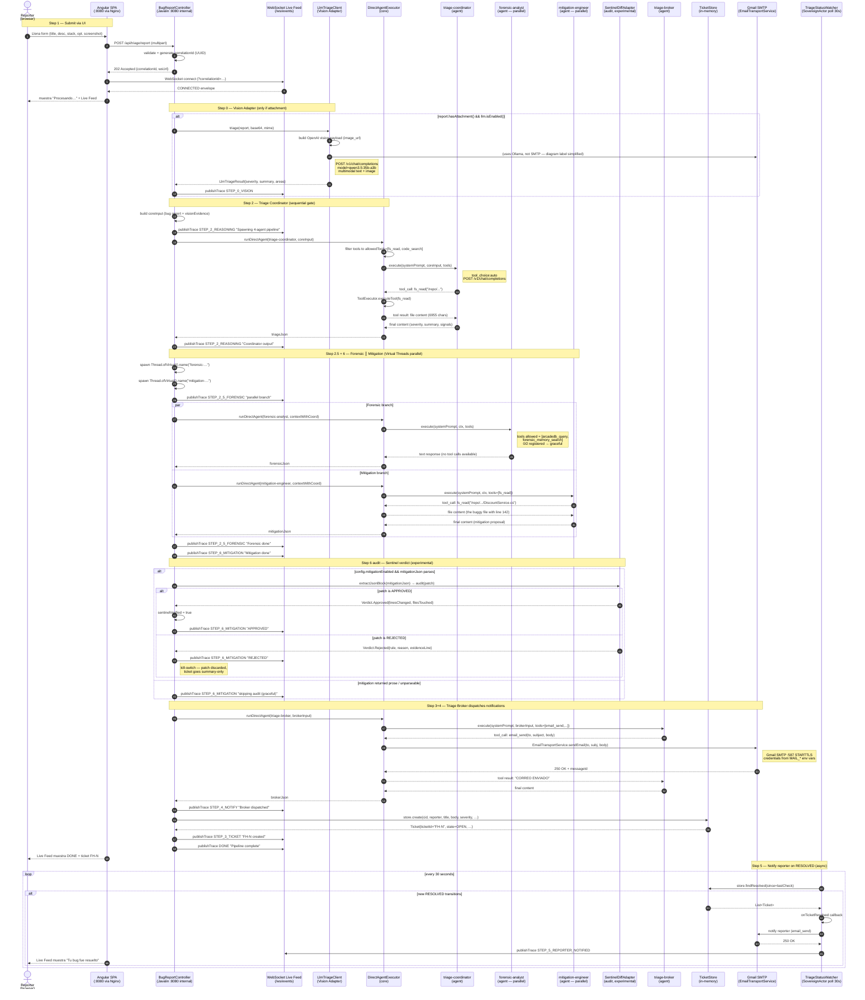
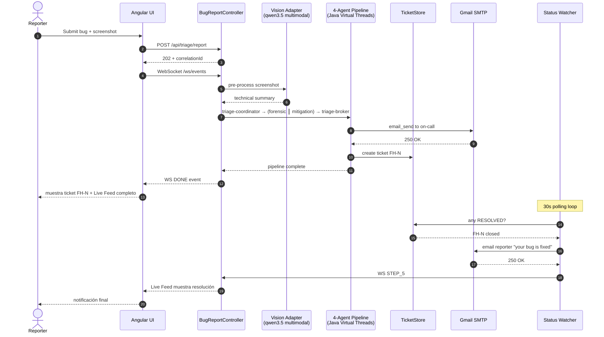

# Diagrama de Secuencia — Fara-Hack 1.0

**Author:** Eber Cruz | **Version:** 1.0.0

> Diagrama de secuencia **end-to-end** del flujo de triaje SRE.
> Refleja el comportamiento real verificado en logs el 2026-04-08.
> Renderizable directamente en GitHub, GitLab, Mermaid Live Editor, o
> draw.io (Arrange → Insert → Advanced → Mermaid).

---

## 1. Diagrama principal — flujo completo (5 mandatory steps + multimodal + parallel branch)



---

## 2. Diagrama secundario — solo el happy path (versión condensada para el demo video)



---

## 3. Notas sobre el diagrama

### 3.1 Por qué hay 2 versiones

- El **diagrama 1** es la verdad operativa completa — todos los actores,
  todos los participantes, los pasos opcionales, los ramales de error.
  Sirve para auditoría, debugging, y para el `AGENTS_USE.md` evidencia
  de observabilidad §6.
- El **diagrama 2** es la versión "happy path" condensada para el video
  demo de 3 minutos. El jurado tiene 180 segundos — necesita ver el
  flujo claro, no los 50 mensajes del completo.

### 3.2 Convenciones

- `Note right of X` — comentarios técnicos sobre el actor adyacente
- `alt … else … end` — branching condicional (Vision opcional, Sentinel
  audit success/fail)
- `par … and … end` — ejecución paralela real (Virtual Threads)
- `loop … end` — polling periódico del watcher
- Pasos numerados con `autonumber` para citar líneas del diagrama
  desde otros docs

### 3.3 Lo que NO está en el diagrama (deliberadamente)

- **HiveMind del core (7 swarm agents)** — está cargado al boot pero
  NO se invoca desde el flujo de fara-hack. Lo reemplazamos por
  `DirectAgentExecutor` directo.
- **NATS bus interno** — corre como servicio compose pero el pipeline
  fara-hack no lo usa para orquestación, solo para journaling de los
  agentes del HiveMind (que están dormidos). El "Sovereign Event Bus"
  del pitch es aspiracional para V1.1.
- **ArcadeDB** — existe como `ArcadeDbService` en el core pero no se
  instancia. Persistencia es in-memory.
- **MCP sidecars (server-github, server-slack)** — diseñados en
  `DECISIONES-APROBADAS-2026-04-07.md` pero NO levantados en el
  compose actual. La integración real es Gmail SMTP únicamente.

### 3.4 Tiempos típicos por step (medidos 2026-04-08)

| Step | Latencia (sec) | Bloqueante / async |
|---|---|---|
| 1 — Submit + 202 response | < 0.1 s | sync |
| 0 — Vision adapter (con imagen) | 5-15 s | sync (blocking processReportAsync) |
| 2 — Triage Coordinator | 20-40 s | sync |
| 2.5 + 6 — Forensic ║ Mitigation | max(20-60, 30-80) = 30-80 s | parallel Virtual Threads |
| Sentinel audit (cuando aplica) | < 50 ms | sync |
| 3+4 — Triage Broker + email | 15-30 s | sync |
| **Total submit → email entregado** | **~2-3 min** | (LLM-bound) |
| 5 — Watcher detecta RESOLVED | hasta 30 s | async polling |

---

## 4. Cómo capturar evidencia del diagrama corriendo

```bash
# 1. Tail los logs estructurados durante una corrida
docker compose logs -f fara-hack | grep -E "STEP_|DIRECT-AGENT|EMAIL_SEND|SENTINEL"

# 2. Capturar el Live Feed via wscat (si lo tenés instalado)
wscat -c "ws://localhost:8080/ws/events?correlationId=<el cid del POST>"

# 3. Snapshot final del store
curl -s http://localhost:8080/api/triage/tickets | python3 -m json.tool

# 4. Verificar el bind mount de mock-eshop desde dentro del container
docker compose exec fara-hack ls -la /repo/src/Services/Catalog.API/Services/

# 5. Forzar Step 5 marcando un ticket como resolved
curl -X POST http://localhost:8080/api/triage/tickets/FH-1/resolve
# Esperar hasta 30s y revisar bandeja del reporter
```

---

## 5. Documentos relacionados

- [`FLUJO-FARA-HACK.md`](FLUJO-FARA-HACK.md) — descripción narrativa del flujo
- [`MANUAL-USUARIO.md`](MANUAL-USUARIO.md) — pasos de usuario para correr y validar
- [`ARCHITECTURE-AGENTX-2026.md`](ARCHITECTURE-AGENTX-2026.md) — 9-section AgentX submission doc
- [`PITCH.md`](PITCH.md) — script del demo video con timing y overlays

`#AgentXHackathon`
