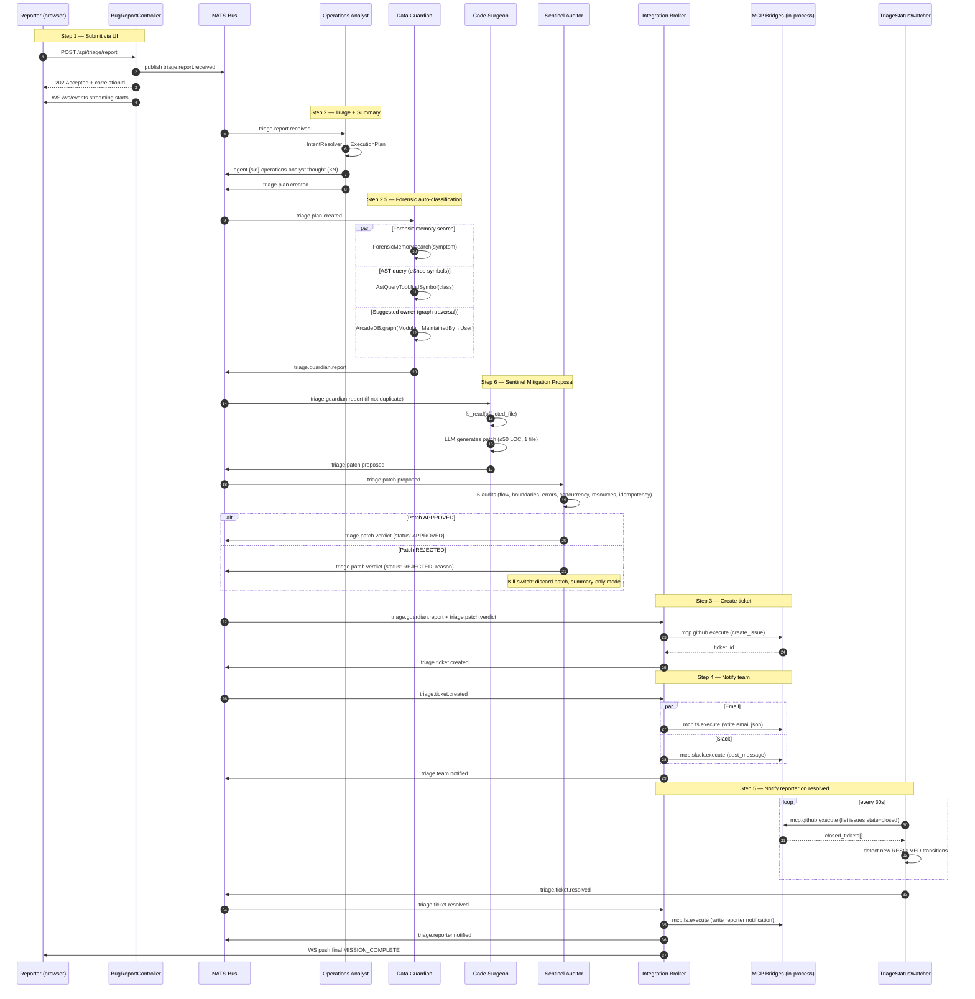

# TRIAGE-PIPELINE — Fara-Hack 1.0

**Author:** Eber Cruz | **Version:** 1.0.0
**Module:** `fara-hack-1.0`
**Status:** Implemented

This document is the technical contract for the bug-report triage
pipeline. It describes **what gets built**, **what events flow through
the bus**, **what the acceptance criteria are**, and **how each step is
tested**. Code reviewers and the implementation pair both work from
this document.

---

## 0. Overview

Fara-Hack implements the **5 mandatory steps** of the AgentX Hackathon
plus **2 differentiator steps**:

| Step | Type | Purpose |
|------|------|---------|
| 1 | Mandatory | Submit bug report via UI |
| 2 | Mandatory | Triage on submit (extract details + initial summary) |
| **2.5** | **Differentiator** | **Forensic auto-classification (duplicate detection + suggested owner)** |
| 3 | Mandatory | Create ticket in ticketing system |
| 4 | Mandatory | Notify technical team (email + communicator) |
| 5 | Mandatory | Notify reporter when ticket resolved |
| **6** | **Differentiator** | **Sentinel Mitigation Proposal (PR + security audit)** |

The pipeline is **event-driven choreography**, not a centralized
orchestrator. Each step is a NATS subscription that reacts to its
input subject and publishes its output subject. Adding/removing a step
= adding/removing a subscription.

---

## 1. Sequence diagram (Mermaid)

> Copy this block directly into draw.io via:
> Arrange → Insert → Advanced → Mermaid



---

## 2. NATS subject hierarchy

All triage subjects use the prefix `triage.` for the business pipeline
and `agent.{sessionId}.{actor}.>` for reasoning traces.

### Pipeline subjects (one per step output)

| Subject | Publisher | Subscribers | Payload |
|---------|-----------|-------------|---------|
| `triage.report.received` | `BugReportController` | `OperationsAnalyst` | `{correlationId, reporterEmail, title, description, stackTrace}` |
| `triage.plan.created` | `OperationsAnalyst` | `DataGuardian` | `{correlationId, plan: ExecutionPlan, summary}` |
| `triage.guardian.report` | `DataGuardian` | `CodeSurgeon`, `IntegrationBroker` | `{correlationId, duplicateOf, duplicateConfidence, affectedModules, suggestedOwner, severityHint, evidenceQueryIds}` |
| `triage.patch.proposed` | `CodeSurgeon` | `SentinelAuditor` | `{correlationId, patch, filesModified, testSuggestions}` |
| `triage.patch.verdict` | `SentinelAuditor` | `IntegrationBroker` | `{correlationId, status: APPROVED\|REJECTED, reason, auditDetails}` |
| `triage.ticket.created` | `IntegrationBroker` | `IntegrationBroker (notify leg)` | `{correlationId, ticketId, ticketUrl, assignedTo, severity}` |
| `triage.team.notified` | `IntegrationBroker` | (terminal — mission progress) | `{correlationId, channels: [email, slack]}` |
| `triage.ticket.resolved` | `TriageStatusWatcher` | `IntegrationBroker (resolve leg)` | `{ticketId, resolvedAt, resolverUser, fixCommit?}` |
| `triage.reporter.notified` | `IntegrationBroker` | (terminal) | `{correlationId, ticketId, reporterEmail}` |

### Reasoning trace subjects (auditability)

| Subject pattern | Purpose |
|---|---|
| `agent.{sessionId}.operations-analyst.thought` | Each reasoning step of the planner |
| `agent.{sessionId}.operations-analyst.decision` | Final plan emitted |
| `agent.{sessionId}.data-guardian.query` | Each query the guardian executes (with `queryId`) |
| `agent.{sessionId}.data-guardian.verdict` | Final verdict |
| `agent.{sessionId}.code-surgeon.thought` | Patch generation reasoning |
| `agent.{sessionId}.sentinel.audit` | Each of the 6 audits with PASS/FAIL |
| `agent.{sessionId}.integration-broker.tool.req` | Outgoing MCP invocation |
| `agent.{sessionId}.integration-broker.tool.resp` | Incoming MCP response |

### MCP wire subjects (internal to bridges)

| Subject | Publisher → Subscriber |
|---|---|
| `mcp.github.execute` | broker → github bridge |
| `mcp.github.response.{correlationId}` | github bridge → broker |
| `mcp.slack.execute` | broker → slack bridge |
| `mcp.slack.response.{correlationId}` | slack bridge → broker |
| `mcp.fs.execute` | broker → filesystem bridge |
| `mcp.fs.response.{correlationId}` | filesystem bridge → broker |
| `mcp.{instance}.heartbeat` | each bridge → bus (every 5s) |

---

## 3. Per-step contracts

### Step 1 — Submit via UI

**Component:** `BugReportController.java` (~200 LOC) + `index.html` + `app.js`

**Trigger:** `POST /api/triage/report` from the static UI form

**Request body:**
```json
{
  "title": "string (max 200)",
  "description": "string (max 8000)",
  "reporterEmail": "string (RFC 5322)",
  "stackTrace": "string optional (max 16000)"
}
```

**Validation:**
- Length caps enforced before any agent sees the input
- Control characters stripped, basic HTML escaping
- Email regex-validated
- Rate limit: 1 req/sec per `X-User-ID` header (reuses `FararoniServer.isRateLimited`)

**Side effects:**
1. Generate fresh `correlationId` (UUID v4)
2. Publish `triage.report.received` envelope to bus
3. Configure `silo.bus().setOutputHook(msg -> sendToSocket(reporterEmail, msg))` so the WS Live Feed shows the trace
4. Return `202 Accepted` with `{correlationId, wsUrl: "/ws/events?userId=<reporterEmail>"}`

**Acceptance criteria:**

- [ ] AC-1.1: Empty title or description returns `400` with explanatory error
- [ ] AC-1.2: Invalid email returns `400`
- [ ] AC-1.3: Valid submission returns `202` within 200ms (no LLM call yet)
- [ ] AC-1.4: The published envelope arrives on `triage.report.received` within 50ms
- [ ] AC-1.5: A WebSocket client connected to `/ws/events?userId=<email>` BEFORE the POST receives the envelope via `outputHook`
- [ ] AC-1.6: Rate limiting triggers `429` after second request in same second from same userId

---

### Step 2 — Triage on submit (extract + summary)

**Component:** `OperationsAnalyst` agent (existing YAML, prompt adapted for bug-triage domain)

**Trigger:** Subscription to `triage.report.received`

**Internal flow:**
1. `IntentResolver.resolve(intent, sessionContext)` produces an `ExecutionPlan` with steps:
   - `extract-stack-trace-frames` (uses `TriageEngine` from core for regex extraction — anti-duplication: reuse, not recreate)
   - `extract-affected-files` (uses `TriageEngine.FILE_PATTERN` regex)
   - `extract-class-names` (uses `TriageEngine.CLASS_PATTERN`)
   - `classify-severity` (LLM call with the extracted signals)
   - `summarize-technically` (LLM call producing 1-paragraph technical summary)
2. `SentinelAuditor.audit(plan)` validates the DAG (no cycles, no orphans)
3. If audit passes → publish `triage.plan.created`
4. If audit fails or `IntentResolver` throws → kill-switch to legacy template path (HU-006-A AC-2)

**Reuse from core (anti-duplication check passed):**

- ✅ `TriageEngine` (`fararoni-core/.../core/agent/forense/TriageEngine.java`) — its regex patterns (`FILE_PATTERN`, `CLASS_PATTERN`, `LINE_PATTERN`, `METHOD_PATTERN`) are exactly what we need for signal extraction. **Reuse, do not duplicate.**
- ✅ `IntentResolver` (M3-06, 43 tests) — generates the DAG
- ✅ `SentinelAuditor` (M4-06) — validates the DAG
- ✅ `MissionTemplateManager` (legacy) — kill-switch fallback path

**Acceptance criteria:**

- [ ] AC-2.1: A bug report with a Java stack trace produces an `ExecutionPlan` with at least the 5 steps above
- [ ] AC-2.2: `agent.{sessionId}.operations-analyst.thought` envelopes are published for each plan step
- [ ] AC-2.3: If `IntentResolver` throws, the legacy template path is used and the user mission completes successfully (kill-switch test)
- [ ] AC-2.4: The published `triage.plan.created` envelope contains a valid summary string and the parsed signals
- [ ] AC-2.5: End-to-end latency from `triage.report.received` to `triage.plan.created` is <8 seconds (LLM-bound)

---

### Step 2.5 — Forensic auto-classification (DIFFERENTIATOR)

**Component:** `DataGuardian` agent (existing YAML, prompt adapted)

**Trigger:** Subscription to `triage.plan.created`

**Internal flow — 3 queries in parallel:**

1. **Forensic memory search**
   - Tool: `forensic_memory_search(query=description, topK=5)` (mmap+SIMD, sub-millisecond)
   - Returns top-K historical bug reports with similarity scores
   - If `topScore > 0.85` → mark as probable duplicate

2. **AST query (eShop symbols)**
   - Tool: `ast_query(symbol=extracted_class_name)` against the pre-indexed eShop repository
   - Returns the file path that defines the symbol
   - Used to populate `affectedModules`

3. **Suggested owner lookup**
   - Tool: `arcadedb_query_graph("SELECT FROM Module WHERE path=? OUT('MaintainedBy')")`
   - Returns the user who has the most commits to the affected module (from git blame history)
   - Populates `suggestedOwner`

**Outputs `triage.guardian.report`:**
```json
{
  "correlationId": "...",
  "duplicateOf": "GH-1234",
  "duplicateConfidence": 0.92,
  "affectedModules": ["src/Services/Catalog.API/Controllers/CatalogController.cs"],
  "suggestedOwner": "@alice",
  "severityHint": "P1",
  "evidenceQueryIds": ["q-441", "q-442", "q-443"]
}
```

**Forbidden by design:**
- Cannot mark `VERIFIED` without a real query result with rowCount > 0
- Cannot invent a `suggestedOwner` if the graph query returned empty
- Cannot use queries without `LIMIT` clause (cost control)

**Acceptance criteria:**

- [ ] AC-2.5.1: The 3 queries execute in parallel (verified by inspecting timestamps in `agent.{sid}.data-guardian.query` envelopes)
- [ ] AC-2.5.2: When a near-duplicate exists in `ForensicMemory`, the report contains `duplicateConfidence > 0.85`
- [ ] AC-2.5.3: When no duplicate exists, `duplicateOf` is `null` (not omitted, not invented)
- [ ] AC-2.5.4: When the AST query finds no symbol, `affectedModules` is `[]` (not invented)
- [ ] AC-2.5.5: Every fact in the report has an `evidenceQueryId` that resolves to a real query in the bus replay
- [ ] AC-2.5.6: End-to-end latency from `triage.plan.created` to `triage.guardian.report` is <500ms (no LLM, only queries)

---

### Step 6 — Sentinel Mitigation Proposal (DIFFERENTIATOR)

**Components:**
- `CodeSurgeon` agent (new YAML: `code-surgeon-agent.yaml`, ~120 LOC)
- `SentinelDiffAdapter.java` (~60 LOC) — wraps a unified diff for the existing `SentinelAuditor`

**Feature flag:** `MITIGATION_PROPOSAL_ENABLED` (default `true`)

**Trigger:** Subscription to `triage.guardian.report` (skipped if `duplicateConfidence > 0.9`)

**Internal flow:**

1. **Code Surgeon**
   - Reads the affected file via `fs_read(/repo/<affectedModule>)` (the eShop repo is mounted read-only at `/repo`)
   - Constructs LLM prompt: bug summary + file content + constraint "patch ≤ 50 lines, 1 file"
   - LLM generates a unified diff candidate
   - Publishes `triage.patch.proposed`

2. **Sentinel audit (reuses existing SentinelAuditor from core)**
   - `SentinelDiffAdapter` converts the diff into the format the auditor expects
   - The auditor runs its 6 standard audits:
     1. **Flow** — does the patch introduce a new path without handling?
     2. **Boundaries** — does it drop tables, delete columns, `rm -rf`?
     3. **Errors** — does it silence critical exceptions?
     4. **Concurrency** — does it add shared mutable state?
     5. **Resources** — does it forget to close streams/connections?
     6. **Idempotency** — running it twice corrupts data?
   - Publishes `triage.patch.verdict` with `APPROVED` or `REJECTED + reason`

3. **Branching:**
   - **APPROVED** → patch attached to the ticket created in Step 3 with tag `Sentinel-Verified`
   - **REJECTED** → kill-switch: patch discarded, ticket created with summary only, `mission.fallback.reason{tag=patch_rejected}` counter incremented

**Anti-duplication check:**
- ✅ `SentinelAuditor` already exists (`fararoni-core/.../intent/SentinelAuditor.java`, M4-06). We do NOT create a new auditor; we adapt the diff input via `SentinelDiffAdapter`.
- ✅ `fs_read` tool already exists in core. We do NOT create a new file reader.
- ❌ `code-surgeon-agent.yaml` does not exist — create new (only YAML, no Java).
- ❌ `SentinelDiffAdapter.java` does not exist — create new (~60 LOC).

**Acceptance criteria:**

- [ ] AC-6.1: When the Code Surgeon produces a safe patch (no DROP/DELETE/rm), the verdict is `APPROVED` and the patch is in the final ticket
- [ ] AC-6.2: When the Code Surgeon produces a dangerous patch (contains `DROP TABLE`), the auditor returns `REJECTED` and the patch is discarded
- [ ] AC-6.3: When the patch is rejected, the mission completes successfully (kill-switch validates) — the user never sees a 500
- [ ] AC-6.4: The 6 audits are visible in `agent.{sid}.sentinel.audit` envelopes for replay
- [ ] AC-6.5: The metric `mission.fallback.reason{tag=patch_rejected}` increments on rejection
- [ ] AC-6.6: With `MITIGATION_PROPOSAL_ENABLED=false`, this entire step is skipped and the mission proceeds directly from Step 2.5 to Step 3

---

### Step 3 — Create ticket

**Component:** `IntegrationBroker` agent (existing YAML, prompt adapted) + `MinimalMcpBridge` instance (`mcp-github`)

**Trigger:** Subscription to `triage.guardian.report` AND `triage.patch.verdict` (waits for both before acting; or only `triage.guardian.report` if Step 6 is disabled)

**Internal flow:**

1. If `duplicateConfidence > 0.9` from Step 2.5 → publish `triage.ticket.comment` instead (add new evidence to existing ticket TICKET-1234)
2. Otherwise, build the ticket payload:
   ```json
   {
     "title": "<from report>",
     "body": "<technical summary> + <forensic evidence> + <patch if APPROVED>",
     "labels": ["<severityHint>", "auto-triage", "<Sentinel-Verified|Summary-Only>"],
     "assignees": ["<suggestedOwner>"]
   }
   ```
3. Invoke MCP via `mcp.github.execute` with `{tool: "create_issue", repo: ..., payload}`
4. Wait for `mcp.github.response.{correlationId}` (Ack within 2s, Result within 30s)
5. Publish `triage.ticket.created`

**MCP-over-bus v2 contract** (HU-006-C):
- `Nats-Msg-Id = correlationId` for idempotent dedup
- AckExplicit two-phase: receive → result
- If sidecar saturated (`queueDepth >= 80%`) → reject with `SIDECAR_SATURATED` immediately, do not queue

**Acceptance criteria:**

- [ ] AC-3.1: The ticket is created via the `mcp.github.execute` subject (verified via bus tail)
- [ ] AC-3.2: The ticket payload contains the technical summary from Step 2 and the forensic evidence from Step 2.5
- [ ] AC-3.3: When `duplicateConfidence > 0.9`, no new ticket is created — instead a comment is added to the existing one
- [ ] AC-3.4: When the GitHub bridge is saturated, the broker rejects with `SIDECAR_SATURATED` within 100ms, and the mission falls back to the filesystem bridge
- [ ] AC-3.5: When the GitHub bridge is offline, the broker uses the filesystem bridge fallback (`MCP_TICKETING_FALLBACK=filesystem`)
- [ ] AC-3.6: A duplicate `correlationId` retried within 2 minutes does not create two tickets (idempotency via `Nats-Msg-Id`)

---

### Step 4 — Notify technical team

**Component:** `IntegrationBroker` (notification leg) + `mcp-slack` + `mcp-fs` bridges

**Trigger:** Subscription to `triage.ticket.created`

**Internal flow:**

1. Build notification payload from the ticket data
2. Fan out two MCP invocations **in parallel** (Virtual Threads):
   - **Email**: `mcp.fs.execute` writes a JSON file to `/sandbox/emails/<correlationId>.json` (mock, no real SMTP for the demo). Real SMTP is opt-in via `EMAIL_PROVIDER=smtp`.
   - **Slack**: `mcp.slack.execute` posts to the configured channel via the official Slack MCP server. If `SLACK_BOT_TOKEN` is missing, falls back to filesystem mock.
3. When both complete, publish `triage.team.notified`

**Severity-aware fan-out (from Step 2.5):**
- `severityHint == "P0"` → Slack + email + (optional) PagerDuty
- `severityHint == "P1"` → Slack + email
- `severityHint == "P2"` → email only
- `severityHint == "P3"` → email only

**Acceptance criteria:**

- [ ] AC-4.1: At least one notification channel is invoked (email OR slack — Q&A confirms "and/or" is enough)
- [ ] AC-4.2: When `severityHint == "P1"`, both Slack and email are invoked
- [ ] AC-4.3: When the Slack bridge is offline, the filesystem mock is used and the mission still completes
- [ ] AC-4.4: The email/slack payloads include the ticket URL from Step 3
- [ ] AC-4.5: The fan-out is parallel: total wall-clock latency = max(email, slack), not sum

---

### Step 5 — Notify reporter when ticket resolved

**Components:**
- `TriageStatusWatcher.java` (~80 LOC) — `SovereignActor` polling every 30s
- `IntegrationBroker` (resolution leg) — reuses existing agent

**Trigger:** Periodic timer inside `TriageStatusWatcher` (every 30s)

**Internal flow:**

1. `TriageStatusWatcher` runs as a `SovereignActor` started during `HackBootstrap`
2. Every 30s, it invokes `mcp.github.execute` with `{tool: "list_issues", state: "closed", since: lastCheck}`
3. For each newly closed issue:
   - Look up the corresponding `Ticket` node in ArcadeDB to find the original `reporterEmail`
   - Publish `triage.ticket.resolved` with `{ticketId, resolvedAt, resolverUser}`
4. `IntegrationBroker` (resolution leg) consumes `triage.ticket.resolved`:
   - Optionally calls `DataGuardian` to fetch a forensic snapshot of the fix (which commit, what files)
   - Invokes `mcp.fs.execute` (or real email if configured) to notify the reporter
   - Publishes `triage.reporter.notified`

**Anti-duplication check:**
- `TriageStatusWatcher` is a new component, but its base class `SovereignActor` (M4-01) already exists in core. We extend, not duplicate.
- The resolution leg of `IntegrationBroker` is the same agent as Step 4, just subscribed to a different subject. No new agent needed.

**Acceptance criteria:**

- [ ] AC-5.1: When a ticket transitions to RESOLVED (closed in GitHub), `triage.ticket.resolved` is published within 30 seconds
- [ ] AC-5.2: The reporter receives a notification (email or filesystem mock) referencing the original ticket
- [ ] AC-5.3: The same RESOLVED transition is not notified twice (the watcher tracks `lastCheck`)
- [ ] AC-5.4: If the reporterEmail is missing from the Ticket node, the watcher logs WARNING and continues (does not crash)
- [ ] AC-5.5: The watcher survives a NATS disconnect: it retries on next poll cycle without losing state

---

## 4. State management

| State | Storage | Lifecycle |
|---|---|---|
| Active triage in progress | ArcadeDB embedded — `MissionExecution` document indexed by `correlationId` | Until mission completes (success or fail) |
| Tickets | ArcadeDB graph — `Ticket` nodes with edges `Ticket-[ASSIGNED_TO]→User`, `Ticket-[DUPLICATE_OF]→Ticket`, `Ticket-[AFFECTS]→Module` | Permanent |
| Reasoning trace | NATS JetStream `agent.{sessionId}.>` subjects | 24h retention |
| Forensic memory (historical bugs) | mmap+SIMD index file under `/app/forensic/` | Permanent, append-only |
| Last poll cursor | In-memory `Instant` field of `TriageStatusWatcher` (recoverable from JetStream on restart) | Process lifetime |
| Reporter→ticket map | Field on `Ticket` node in ArcadeDB | With ticket lifetime |

---

## 5. Error handling — three layers

| Layer | Failure mode | Response |
|---|---|---|
| **Bus** (`SovereignBusGuard`) | Subscriber throws | Message → DLQ, bus continues, other subs unaffected (validated by `AgentDeathTest`) |
| **Pipeline** (`SovereignMissionEngineV2`) | `IntentResolver` throws or `SentinelAuditor` rejects | Kill-switch to legacy template path; mission completes (validated by HU-006-A AC-2 tests) |
| **Tool** (`McpProxySkill v2`) | MCP bridge offline or saturated | Retry idempotent ops with exponential backoff; non-idempotent → escalate to human; TTL eviction of pending requests via Caffeine |

---

## 6. Test plan

### E2E test: `TriagePipelineE2ETest.java` (~250 LOC)

| Test | Scenario | ACs covered |
|---|---|---|
| `freshReportCreatesTicketAndNotifies` | Happy path with no duplicate | AC-1.* through AC-4.* + AC-5.1 |
| `duplicateReportCommentsOnExistingTicket` | `duplicateConfidence > 0.9` | AC-2.5.2, AC-3.3 |
| `dangerousPatchIsRejectedAndFallsBackToSummary` | Code Surgeon proposes `DROP TABLE`, Sentinel rejects | AC-6.2, AC-6.3, AC-6.5 |
| `safePatchIsAttachedToTicket` | Code Surgeon proposes safe diff | AC-6.1, AC-6.4 |
| `githubBridgeOfflineFallsBackToFilesystem` | `mcp-github` not running | AC-3.5 |
| `slackBridgeOfflineNotificationStillSent` | `mcp-slack` not running | AC-4.3 |
| `resolvedTicketNotifiesReporterWithin30s` | Watcher polling cycle | AC-5.1, AC-5.2 |
| `intentResolverFailureFallsBackToTemplates` | Inject exception in resolver | AC-2.3 |
| `webSocketReceivesLiveTrace` | UI client connected, sees envelopes in order | AC-1.5 |
| `idempotentRetryDoesNotDuplicateTicket` | Same correlationId retried | AC-3.6 |

### Unit tests (already specified in respective HUs)

- `MinimalMcpBridgeTest` (~80 LOC) — process spawn, watchdog, NATS bridge round-trip
- `McpBridgeManagerTest` (~50 LOC) — registration, env-var-driven bridge selection
- `SentinelDiffAdapterTest` (~60 LOC) — diff parsing, audit invocation, verdict mapping

### Chaos tests (reused from `fararoni-core/.../combat/chaos/`)

These already exist and protect the underlying infrastructure:
- `AgentDeathTest` — bus survives subscriber crash
- `BackpressureTest` — message avalanche, no loss
- `MemoryLeakTest` — long-run stability
- `DlqResurrectionTest` — failed messages recoverable
- (Future) `SidecarOutageTest` — adapted to `MinimalMcpBridge` failures

---

## 7. Anti-duplication summary

Components reused from `fararoni-core` (no new code):

| Existing component | Used in step | Why we don't recreate |
|---|---|---|
| `TriageEngine` (`forense/`) | Step 2 — regex extraction | Has `FILE_PATTERN`, `CLASS_PATTERN`, `LINE_PATTERN`, `METHOD_PATTERN` ready |
| `IntentResolver` | Step 2 — DAG planning | M3-06, 43 tests, mature |
| `SentinelAuditor` | Steps 2 and 6 — DAG audit + diff audit | M4-06, 6 audits ready |
| `ChoreographyCoordinator` | Whole pipeline — parallel execution | M4-03, 103ms parallel validated |
| `SovereignActor` | `TriageStatusWatcher` base class | M4-01, mailbox + Virtual Threads |
| `FararoniServer.setOutputHook` | Step 1 — Live Feed UI | Already wires bus → WebSocket (line 327) |
| `ForensicMemory` (`forense/`) | Step 2.5 — duplicate search | mmap+SIMD index |
| `ArcadeDbService` | Steps 2.5, 3, 5 — graph + document | Embedded, multi-model |
| `fs_read` tool | Step 6 — read affected file | Already in `ToolRegistry` |
| `ast_query` tool | Step 2.5 — symbol lookup | Already in `ToolRegistry` |
| `CompositeSovereignBus` | All steps — fallback NATS↔InMemory | Automatic |

Components newly written in `fara-hack-1.0`:

| New component | LOC | Why it can't be reused |
|---|---|---|
| `BugReportController.java` | ~200 | HTTP endpoint specific to bug-report use case |
| `TriageStatusWatcher.java` | ~80 | Polling logic specific to ticket resolution |
| `SentinelDiffAdapter.java` | ~60 | Adapts unified diffs to the existing auditor's input format |
| `MinimalMcpBridge.java` | ~150 | In-house MIT MCP bridge (cannot use enterprise sidecar) |
| `McpBridgeManager.java` | ~80 | Orchestrates the 3 bridges |
| `code-surgeon-agent.yaml` | ~120 | New agent definition |
| `index.html` + `app.js` | ~180 | Static UI |
| **Total new code** | **~870** | |

---

## 8. Implementation order (8-9 abril)

### Day 1 — 8 April

**Morning:**
1. 🚨 `git checkout -b feature/fara-hack-1.0-impl`
2. `BugReportController.java` (Step 1)
3. `index.html` + `app.js` (Step 1)
4. `HackBootstrap.java` real wiring (replace stub)
5. Smoke test: form → endpoint → bus → WS shows envelope

**Afternoon:**
6. `MinimalMcpBridge.java` + `McpBridgeManager.java` (in-house bridges)
7. Update `Dockerfile` to add Node.js (Option A)
8. Update `docker-compose.yml` to 2 services (nats + fara-hack)
9. **`TriageStatusWatcher.java`** (priority — closes Step 5)
10. Adapt prompts of existing 3 agents for bug-triage domain

### Day 2 — 9 April

**Morning:**
11. `code-surgeon-agent.yaml` (Step 6 differentiator)
12. `SentinelDiffAdapter.java` (Step 6)
13. `TriagePipelineE2ETest.java` (10 test methods)
14. Wire Step 2.5 forensic queries into Data Guardian flow
15. Validate kill-switch with dangerous patch test

**Afternoon:**
16. End-to-end smoke: `docker compose up --build` from a clean dir
17. Capture observability evidence files (`examples/trace-sample.json`, etc.)
18. Record demo video (3 min, English, `#AgentXHackathon`)
19. Push to public MIT repo
20. Submission

---

## 9. Open questions for the owner

These do not block the design but are needed before implementation:

1. **eShop repo path:** is it cloned locally already, or do we use `./mock-eshop` placeholder for the demo?
2. **GitHub repo for tickets:** do we have a target repo for `mcp-github` to create issues in, or do we create a throwaway demo repo?
3. **Slack workspace:** do we have a sandbox workspace + bot token, or do we run with the filesystem fallback only?
4. **Default LLM in `.env.example`:** local Ollama (`llama3.2:3b`) or cloud (`anthropic/claude-3-haiku` via OpenRouter)?
5. **Forensic memory seed data:** do we pre-load 50-100 fake historical bug reports so Step 2.5 can demonstrate duplicate detection? If yes, who curates them?

---

## 10. Sello

**Diseño completo. NO implementado.** Cuando el owner diga "ya"
mañana 8 de abril, se ejecuta §8 paso a paso.
