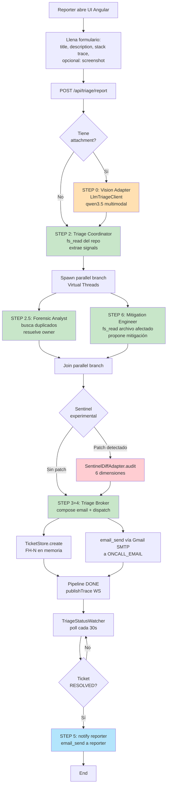

# Flujo Fara-Hack 1.0 — SRE Bug Triage Pipeline

**Author:** Eber Cruz | **Version:** 1.0.0

> Documenta el flujo end-to-end tal como funciona hoy.
> **Audiencia:** Jurado del AgentX Hackathon, futuros maintainers,
> demo presenters.

---

## 1. Visión de 30 segundos

Fara-Hack 1.0 recibe un reporte de bug desde una UI Angular, lo procesa
con un pipeline de **4 agentes especializados** orquestados por Java 25
(Virtual Threads paralelos), genera un ticket en un store interno, y
**notifica al on-call engineer por email real (Gmail SMTP)**. Cuando el
ticket se cierra, un watcher periférico notifica al reporter original.
Todo corre con **`docker compose up --build`** sin dependencias externas
(salvo Ollama corriendo en el host con `qwen3.5:35b-a3b` pulleado).

---

## 2. Componentes (mapa de bloques)

```
┌─────────────────────────────────────────────────────────────────────┐
│                        REPORTER (browser)                            │
│  Angular 20 SPA — http://localhost:8080/                             │
└────────────┬────────────────────────────────────────────────────────┘
             │ HTTP POST /api/triage/report  (multipart, text + image)
             │ WebSocket /ws/events?correlationId=…  (live trace)
             ▼
┌─────────────────────────────────────────────────────────────────────┐
│  fara-hack-web (nginx 1.27)                                          │
│  Sirve el SPA + reverse-proxy /api y /ws → fara-hack:8080            │
│  HEALTHCHECK wget 127.0.0.1/  (IPv4 only)                            │
└────────────┬────────────────────────────────────────────────────────┘
             │ Internal compose network
             ▼
┌─────────────────────────────────────────────────────────────────────┐
│  fara-hack-app (Java 25 distroless ~85 MB)                           │
│                                                                       │
│  ┌─────────────────────────────────────────────────────────────┐    │
│  │ BugReportController (Javalin REST + WebSocket)              │    │
│  │   • POST /api/triage/report                                 │    │
│  │   • POST /api/triage/tickets/{id}/resolve                   │    │
│  │   • GET  /api/triage/tickets                                │    │
│  │   • WS   /ws/events?correlationId=…                         │    │
│  │   • CORS anyHost (defense-in-depth tras Nginx)              │    │
│  │   • WS idle timeout 10 min (sobrevive LLM lentos)           │    │
│  └─────────┬───────────────────────────────────────────────────┘    │
│            │                                                         │
│            ▼                                                         │
│  ┌─────────────────────────────────────────────────────────────┐    │
│  │ STEP 0 — LlmTriageClient (Vision Adapter)                   │    │
│  │   • Solo si el reporter adjuntó imagen                      │    │
│  │   • POST /v1/chat/completions con image_url base64          │    │
│  │   • Modelo: qwen3.5:35b-a3b (multimodal MoE)                │    │
│  │   • Output: technicalSummary + severity hint                │    │
│  └─────────┬───────────────────────────────────────────────────┘    │
│            │                                                         │
│            ▼                                                         │
│  ┌─────────────────────────────────────────────────────────────┐    │
│  │ STEP 2-6 — 4-Agent Pipeline (Java Virtual Threads)          │    │
│  │                                                              │    │
│  │   ① triage-coordinator   (sequential gate)                  │    │
│  │           │                                                  │    │
│  │           ▼                                                  │    │
│  │   ② forensic-analyst  ║  ③ mitigation-engineer              │    │
│  │      (parallel via Thread.ofVirtual())                      │    │
│  │           │                                                  │    │
│  │           ▼                                                  │    │
│  │   🟡 SentinelDiffAdapter audit (Step 6 — experimental)      │    │
│  │           │                                                  │    │
│  │           ▼                                                  │    │
│  │   ④ triage-broker        (sequential, dispatches email)     │    │
│  │                                                              │    │
│  │  Cada agente: DirectAgentExecutor → OpenAICompatibleClient   │    │
│  │              → Ollama /v1/chat/completions con tool_choice   │    │
│  └─────────┬───────────────────────────────────────────────────┘    │
│            │                                                         │
│            ├─────────────────────┬────────────────────────────┐     │
│            ▼                     ▼                            ▼     │
│  ┌──────────────────┐  ┌──────────────────┐  ┌─────────────────────┐│
│  │ TicketStore      │  │ Gmail SMTP       │  │ TriageStatusWatcher ││
│  │ (in-memory)      │  │ EmailTransport   │  │ (SovereignActor)    ││
│  │ FH-1, FH-2 …     │  │ MAIL_* env vars  │  │ poll 30s            ││
│  └──────────────────┘  └──────────────────┘  └─────────────────────┘│
│                                                          │           │
│                                                          ▼           │
│                                          (when ticket → RESOLVED)    │
│                                                  email reporter      │
└─────────────────────────────────────────────────────────────────────┘
                                ▲
                                │
                       ┌────────┴────────┐
                       │ Ollama (host)   │
                       │ qwen3.5:35b-a3b │
                       │ /v1/chat/comp   │
                       └─────────────────┘
```

---

## 3. Diagrama de flujo (Mermaid flowchart)



**Leyenda:**
- 🟢 verde — paso del pipeline implementado y verificado end-to-end
- 🟠 naranja — paso opcional (solo si hay attachment)
- 🔴 rojo — paso experimental (Sentinel audit, depende de que el agent emita JSON)
- 🔵 azul — actor periférico (watcher polling)

---

## 4. Cumplimiento de requisitos del hackathon

| # | Requirement (assignment.md) | Componente que lo cumple | Estado |
|---|---|---|---|
| 1 | Submit report via UI | `BugReportController` + Angular SPA | ✅ |
| 2 | Triage on submit (extracts details + summary using code/docs) | `triage-coordinator` agent + `fs_read` sobre `/repo` (mock-eshop bind mount) | ✅ |
| 3 | Create ticket | `TicketStore.create()` (in-memory) | ✅ |
| 4 | Notify team via email/communicator | `triage-broker` + `email_send` tool → `EmailTransportService` → Gmail SMTP | ✅ |
| 5 | Notify reporter on resolved | `TriageStatusWatcher` (SovereignActor polling 30 s) | ✅ |
| Multimodal | text + image/log/video | `LlmTriageClient` con `qwen3.5:35b-a3b` (image_url base64) | ✅ |
| Guardrails | prompt injection defense | `<USER_INPUT>...</USER_INPUT>` wrapping en todos los systemPrompt | ✅ |
| Observability | logs/traces/metrics | `[DIRECT-AGENT]` structured logs + WS Live Feed `/ws/events` | 🟡 (faltan métricas Prometheus) |
| Integrations | mocked or real | Gmail SMTP **real**; ticketing **mocked** (in-memory) | ✅ |
| E-commerce code | medium/complex | `mock-eshop/src/Services/Catalog.API/` (3 archivos C# realistas, bug en `DiscountService.cs:142`) | 🟡 (3 archivos, no es "medium/complex") |

---

## 5. Stack tecnológico

| Capa | Tecnología | Por qué |
|---|---|---|
| **Backend** | Java 25 + Javalin 6.x + Virtual Threads (Loom) | Pipeline paralelo de agentes sin pool exhaustion |
| **Image** | `eclipse-temurin:25-jre-alpine` (~230 MB) | Distroless no soporta Java 25 todavía; Alpine es la siguiente mejor |
| **Orquestación** | `BugReportController.processReportAsync` (Java imperativo) | Sin missions/DAG YAML — el "DAG" vive en código Java directamente |
| **Agentes** | YAMLs en `workspace/.fararoni/config/agentes/` cargados por `AgentTemplateManager` del core | Mismo path que `agentmail`, invocables vía `DirectAgentExecutor` |
| **LLM** | Local Ollama con `qwen3.5:35b-a3b` (multimodal MoE 36 B) | Único modelo del setup, soporta texto + visión |
| **Tools** | `fs_read`, `email_send`, `email_fetch`, `email_read` (registrados en core `ToolRegistry`) | Las únicas herramientas reales del pipeline; otras declaradas en YAMLs son aspiracionales |
| **Frontend** | Angular 20 + WebSocket | UI estática + Live Feed reactivo |
| **Reverse proxy** | Nginx 1.27-alpine | Reverse proxy + único puerto host expuesto (`8080`) |
| **Bus interno** | NATS JetStream 2 (servicio compose, journaling solamente) | El pipeline NO usa el bus para orquestación, lo usa solo el HiveMind del core (que está cargado pero no se invoca) |
| **Email** | Jakarta Mail vía `EmailTransportService` del core | Gmail SMTP `:587` STARTTLS, IMAP `:993` SSL |
| **Persistencia** | In-memory `ConcurrentHashMap` (TicketStore + WS sessions) | ArcadeDB existe en el core pero NO está corriendo; roadmap V1.1 |

---

## 6. Variables de entorno (resumen)

Archivo `.env.example` para detalles. Las críticas:

```bash
# LLM (multimodal vision + agentic reasoning)
LLM_SERVER_URL=http://host.docker.internal:11434
LLM_MODEL_NAME=qwen3.5:35b-a3b
OPENAI_COMPAT_BASE_URL=http://host.docker.internal:11434/v1
OPENAI_COMPAT_MODEL=qwen3.5:35b-a3b

# Mail (Gmail SMTP — gitignored en .env real)
MAIL_HOST=smtp.gmail.com
MAIL_PORT=587
MAIL_USERNAME=
MAIL_PASSWORD=          # Gmail App Password (2FA required)
MAIL_IMAP_HOST=imap.gmail.com
MAIL_IMAP_PORT=993
MAIL_SENDER=
MAIL_SENDER_NAME=fara-agent

# On-call recipient (fallback al reporter si no se setea)
ONCALL_EMAIL=

# eShop bind mount (donde el agent hace fs_read)
ESHOP_REPO_PATH=./mock-eshop
```

---

## 6.5 Severity-aware notification gating

El `triage-broker` aplica una regla de filtrado basada en severity
**antes** de invocar `email_send`. Implementada en el systemPrompt
del agente (`workspace/.fararoni/config/agentes/triage-broker-agent.yaml`):

| Severity | Acción del broker | Justificación |
|---|---|---|
| **P0** (production outage, data loss, payment failure) | `email_send` → Gmail SMTP | Crítico — despertar al on-call inmediatamente |
| **P1** (major feature broken, exception en critical path) | `email_send` → Gmail SMTP | Alto — notificar dentro de horas hábiles |
| **P2** (minor feature, performance regression) | Devuelve `NO_EMAIL`, no llama tool | No despertar al on-call por algo no urgente |
| **P3** (cosmetic, edge case) | Devuelve `NO_EMAIL`, no llama tool | El ticket queda en cola para sprint planning |

**Por qué la regla:** Es la práctica SRE estándar (PagerDuty,
Incident.io, etc.) — paginación selectiva evita alert fatigue. El
ticket SIEMPRE se crea en el `TicketStore` independiente de la
severidad; solo varía si dispara la notificación humana.

**Cómo verificarlo en logs:**

```bash
# Si ves "Broker dispatched (8 chars)" → 8 == len("NO_EMAIL"), severity P2/P3
# Si ves "Broker dispatched (200+ chars)" → email payload real, severity P0/P1
docker compose logs fara-hack --since=5m | grep "Broker dispatched"
```

---

## 7. Limitaciones conocidas y roadmap V1.1

| Área | Estado V1.0 | V1.1 (post-hackathon) |
|---|---|---|
| **Sentinel Mitigation Proposal (Step 6)** | Wired pero el agente emite prosa en vez de JSON estricto → Sentinel skipea con "could not parse" | Migrar a Ollama JSON mode (`response_format`) o usar markdown fence parser |
| **ArcadeDB persistence** | No corre en compose, `TicketStore` es in-memory | Levantar ArcadeDB embebido para persistir tickets + audit trail |
| **OpenTelemetry** | NATS-native distributed tracing con `AgentSpan` (compatible OTel Semantic Conventions) | OTel Collector con receiver NATS → Cloud Trace |
| **HU-006-A IntentResolver pipeline** | Existe en core como `📋 Diseño`, NO implementado | Wiring `executeWithReasoningPipeline` + flag `MISSION_REASONING_PIPELINE_ENABLED` |
| **Tools del core para forensic-analyst** | `arcadedb_query`, `forensic_memory_search` declarados en YAML pero NO registrados en `ToolRegistry` → 0/2 disponibles | Registrar los tools en core, conectar a `ArcadeDbService` |
| **Métricas Prometheus** | Solo logs estructurados + WS traces | Endpoint `/api/metrics` con Micrometer + GMP scraping |
| **mock-eshop** | 3 archivos C# (Catalog.API) | Clonar el `dotnet/eShop` real (~50 MB) y montarlo |

---

## 8. Documentos relacionados

- [`docs/architecture/DIAGRAMA-SECUENCIA.md`](../architecture/DIAGRAMA-SECUENCIA.md) — diagrama de secuencia completo (Mermaid sequenceDiagram)
- [`docs/guides/MANUAL-USUARIO.md`](MANUAL-USUARIO.md) — manual paso a paso para correr y validar el sistema
- [`docs/internal/ARCHITECTURE-AGENTX-2026.md`](../internal/ARCHITECTURE-AGENTX-2026.md) — 9-section AgentX submission doc
- [`docs/guides/PITCH.md`](PITCH.md) — script del demo video de 3 min (English)
- [`ROADMAP.md`](../ROADMAP.md) — tablero vivo del proyecto
- [`COMMIT-NOTES.txt`](../COMMIT-NOTES.txt) — bitácora de cambios por commit

`#AgentXHackathon`
